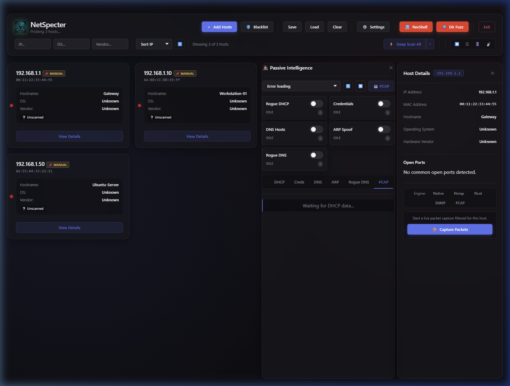

<div align="center">
  
</div>

# NetSpecter: Network Host Detection & Forensic Scanner

A modern, cross-platform desktop application built with Electron, Node.js, and Vanilla JS that provides deep network visibility, OS fingerprinting, and forensic-level port scanning functionalities. Includes a comprehensive **Offensive Penetration Testing** suite for red team operations.



## Features

- **Blazing Fast Subnet Sweeping**: Utilizes heavily concurrent asynchronous ICMP Ping sweeps followed by localized ARP table inspection to instantly discover all physical devices on your local network.
- **Advanced Hardware Identification**: Actively intercepts discovered MAC Addresses and resolves them via a local memory cache backed by a rate-limited, dynamic lookup to the live `macvendors.com` API to provide highly accurate Manufacturer readings (e.g., *Raspberry Pi Foundation*, *Sony Interactive Entertainment*, *Apple, Inc.*).
- **Heuristic OS Fingerprinting**: Intelligently guesses the underlying Operating System (Windows, macOS, Linux, iOS, Android) by analyzing the hardware vendor combined with unique port signatures (e.g., `445` + `135` vs `22` + `548`).

### ⚔️ Offensive Pentest Suite (NEW)
- **Multi-Protocol Brute-Force Engine**: Integrated [Hydra](https://github.com/vanhauser-thc/thc-hydra) for high-speed multi-protocol credential stuffing (SSH, FTP, Telnet, HTTP, SMB, RDP, etc.). Supports custom wordlists and protocol-specific targeting.
- **Metasploit RPC Control Plane**: Full orchestration of [Metasploit Framework](https://www.metasploit.com/) via MSFRPC. Launch exploits, manage sessions, and interact with the Metasploit database directly from the NetSpecter UI.
- **Interactive Reverse Shell Hub**: Multi-handler shell listener supporting Bash, Python, PowerShell, and Netcat reverse shells. Feature-rich terminal emulation with auto-reconnect capabilities.
- **Web Directory Fuzzer**: Fast, concurrent web path discovery to locate hidden `admin`, `config`, and backup files without external dependencies.
- **SMB/NFS Share Explorer**: Deep inspection of network shares to identify broad permissions and sensitive data exposure. Browse and download files directly within the dashboard.

### 🕵️ Network Intelligence & Discovery
- **Forensic Deep Scans**: Click on any discovered host to trigger a visually engaging, cancellable Deep Scan. The backend chunks a raw socket sweep across all **65,535 TCP ports** to bypass operating system networking limits.
- **VLAN Hopping & Tag Detection**: Integrates with Wireshark's `tshark` CLI to passively listen for 802.1Q tagged frames on your network interfaces, exposing misconfigured trunk ports and VLAN hopping vulnerabilities.
- **Passive Network Intelligence**: Advanced raw packet capture capabilities utilizing the `tshark` backend. Detect rogue DHCP servers, sniff cleartext credentials (FTP, HTTP Basic, POP3, IMAP), passively harvest DNS/mDNS queries to discover stealth hosts, detect ARP spoofing attacks in real-time, and seamlessly export live traffic to `.pcap` files.
- **SNMP Walking & MIB Parsing**: Walk SNMPv1/v2c/v3 devices to pull routing tables, interface stats, and firmware versions with intelligent OID parsing and caching.
- **Interactive Topology Map**: Visual network graph powered by Cytoscape.js showing hosts, subnets, and gateway relationships.
- **CVE Discovery & Badge Injection**: NetSpecter automatically parses incoming Nmap `vuln` terminal outputs asynchronously in real-time. Matches against CVE vulnerabilities automatically map to the host's `deepAudit` cache, injecting stylized vulnerability definitions and dynamic links into the Details panel.

### 🧳 General Management
- **Dashboard Filtering & Sorting**: Powerful client-side search indexing allows users to seamlessly filter discovered hosts by IP address, detected Operating System, or Hardware Vendor map. 
- **Data Persistence**: Offline session persistence allows saving all network scan states, deep scan vulnerabilities, banners, and TLS traits to a local JSON file.
- **Persistent Settings UI**: A unified modal to manage backend orchestration tool dependencies. Automatically detects Nmap, Tshark, Hydra, and Smbclient availability in your system's PATH.

---

## 📦 Installation

### Windows
Download the latest `.exe` (NSIS installer) or `.exe` (portable) from the [Releases](https://github.com/robermar23/netspectre/releases) page and run it. No additional setup required.

### macOS
Download the `.dmg` from the [Releases](https://github.com/robermar23/netspectre/releases) page, open it, and drag NetSpecter to your Applications folder.

### Linux (Recommended: `.deb`)
The **`.deb` package** is the recommended way to install on Debian/Ubuntu-based distributions. It automatically handles all system dependencies and provides full desktop integration.

```bash
# Download the latest .deb from Releases, then:
sudo dpkg -i netspectre_*.deb

# If there are missing dependencies, fix them with:
sudo apt-get install -f
```

---

## 📖 Complete Documentation
For a comprehensive breakdown of exactly how to use each feature, step-by-step UI breakdowns, and advanced Nmap exploitation techniques, please read the [Getting Started Guide](docs/getting-started-guide.md).

---

## 🚀 Developer Onboarding

This project uses a split-process architecture standard for modern Electron applications, utilizing Vite as the frontend bundler for hyper-fast hot module replacement (HMR).

### Tech Stack

- **Container**: [Electron](https://www.electronjs.org/) (Strict `contextIsolation` enabled)
- **Frontend / Bundler**: [Vite](https://vitejs.dev/) + Vanilla HTML/CSS/JS (Zero framework bloat)
- **Backend / OS Bridge**: Node.js (`net`, `tls`, `child_process`, `os`)
- **Testing**: Vitest (Targeting ~80% coverage across Main and Renderer)

### Prerequisites

Ensure you have the following installed on your machine:

- Node.js (v18 or higher recommended)
- `npm` or `yarn`
- Your OS's native ping utility (already pre-installed on Windows/macOS/Linux)

### 1. Installation

Clone the repository and install the Node dependencies.

```bash
git clone https://github.com/robermar23/NetSpecter.git
cd NetSpecter
npm install
```

### 2. Local Development

To spin up the application in a local development environment with Hot Reloading, run the concurrent dev script:

```bash
npm run dev
```

### 3. Production Build

To bundle the application into a standalone, distributable executable, run:

```bash
npm run build
```

---

## Architecture Overview

The codebase is strictly separated to adhere to Electron's security model:

* **`src/main/`**: The privileged Node.js backend environment. Executes network sockets, file system writes, and child process spawns.
* **`src/main/preload.js`**: The secure IPC Bridge. Selectively exposes specific backend functionalities to the frontend `window.electronAPI` namespace.
* **`src/renderer/`**: The unprivileged UI presentation layer. Glassmorphic CSS styling and Vanilla JS dashboard controllers.
* **`src/shared/`**: Common IPC channels, network constants, and utility types shared across all processes.

---

## License

This project is open-sourced software licensed under the [MIT license](LICENSE).

### Third-Party Software Disclosures
- **Nmap**: This application can optionally interact with [Nmap](https://nmap.org) if the user has independently installed it on their system. NetSpecter acts as a graphical front-end for Nmap functionalities.
- **Wireshark/Tshark**: NetSpecter can optionally utilize `tshark` (part of [Wireshark](https://www.wireshark.org/)) for passive VLAN tag discovery and packet capture.
- **Hydra**: NetSpecter integrates [Hydra](https://github.com/vanhauser-thc/thc-hydra) for multi-protocol brute-forcing. 
- **Metasploit**: NetSpecter can optionally connect to the [Metasploit Framework](https://www.metasploit.com/) via MSFRPC for advanced exploitation workflows.
- **Net-SNMP & Cytoscape**: NetSpecter bundles [net-snmp](https://www.npmjs.com/package/net-snmp) for JavaScript SNMP communication and [cytoscape](https://js.cytoscape.org/) for graph visualization.

